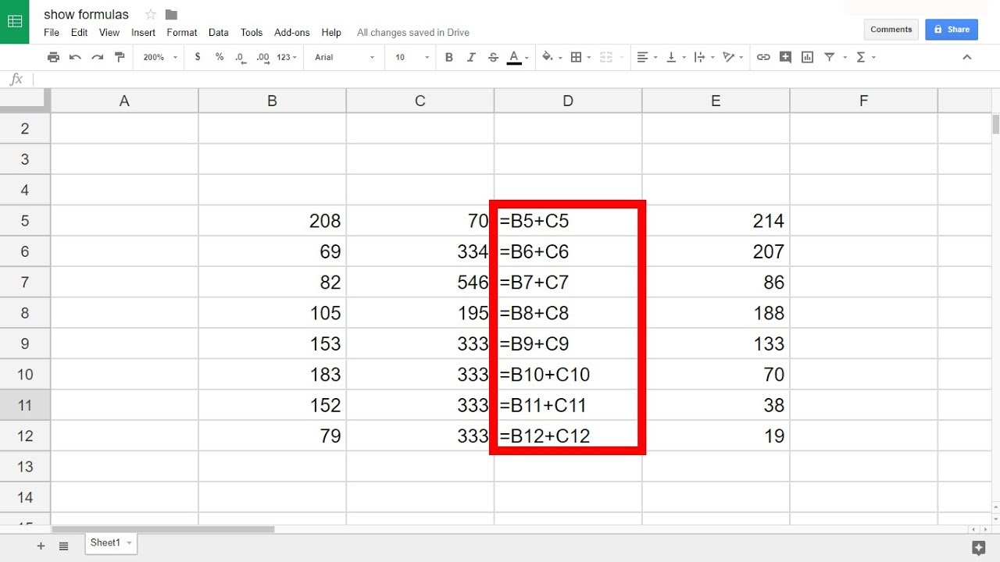

# Exploring the Relationship Between Height and Arm Span 📏🤲

## Objective 🎯
To measure the height and arm span of classmates, record these measurements, graph them, and explore their relationship. Aim to create a simple function that explains this relationship.

## Materials 🛠️
- Measuring tape (cm or inches)
- Graph paper
- Pencil and eraser
- Calculator

## Part 1: Measurement 📐  🕒 15 mins 
1. **Form groups** of at least four students. 
2. **Measure the height** of each group member. 
3. **Measure the arm span** of each group member. 
4. **Record your measurements** in the table. 

### Data Recording Table 📋
Record the data using these three columns inside a google sheet. 

| Student Name | Height | Arm Span |

---

### How to Use Google Sheets: A Student Guide 📚

Google Sheets is a powerful tool for creating, editing, and sharing spreadsheets. Here's a quick guide to get you started with entering data and using formulas.

#### Step 1: Inputting Table Data 📝

1. **Open Google Sheets**: Go to [Google Sheets](https://sheets.google.com) and either start a new spreadsheet or open an existing one.
2. **Select a Cell**: Click on the cell where you want to start entering data (e.g., A1).
3. **Type Your Data**: Just start typing. Press `Enter` to move down to the next row or `Tab` to move to the next column.
4. **Fill Down or Across**: To quickly copy data or formulas, select the cell with the content you want to copy, hover over the small square at the bottom right corner of the cell (the fill handle), and drag it down or across.

#### Step 2: Inputting a Formula 🔢 

<strong> Written Directions </strong>

  
  1. Select a Cell for Your Formula**: Click on the cell where you want the result of the formula to appear.   
  2. Start with an Equals Sign: Every formula begins with an equals sign (`=`). This tells Google Sheets that what follows is a formula.   
  3. Type Your Formula: After the equals sign, type your formula. For example, to sum numbers in cells A1 through A5, you would type `=SUM(A1:A5)`.   
  4. Press Enter: Once you've typed your formula, press `Enter` to run it. The cell will now display the result.  
     

#### Step 3: Inputting your Formula 🔢

  Direct Linear Formula 📈 
  
  <pre><code>
    y = mx + b 
  </code></pre>

If you're armed with the slope (`m`) and y-intercept (`b`) of   your linear relationship, crafting the formula is a breeze

Where:
- `y` 🎯 is the dependent variable (the value you're solving for),
- `m` ⬆️ is the slope of the line (how much `y` changes for a one-unit change in `x`),
- `x` 📊 is the independent variable,
- `b` 🚩 is the y-intercept (the value of `y` when `x` is 0).

<strong> Example  🔢</strong>

  Suppose you have a dataset where   
  - X (independent variable) represents hours studied 📚,  
  - Y (dependent variable) represents the exam score 📝,  
  - and you know that for every hour studied,
     the exam score increases by 5 points (slope = 5),
      and the base score (y-intercept) is 50 points.  
  
  To calculate the exam score based on hours studied,   you would input the following formula in Google Sheets:
  
   =5 * A2 + 50 

---

## Part 3: Graphing 📊 🕒 10 mins 🕒
1. **Plot the data** on graph paper, using height for the x-axis and arm span for the y-axis. 
2. **Label each axis** with the correct measurement unit. 
3. **Draw points** for each set of measurements and **connect the dots** if a pattern is visible. 

## Part 4: Creating a Function ➗ 🕒 10 Mins 🕒
1. **Analyze the graph** to identify if the relationship between height and arm span appears linear.
2. **Discuss and propose a simple function** (e.g., `y = x` or `y = x + a`) that might describe this relationship. 

## Reflection Questions 🤔 🕒 10 Mins 🕒
1. How well did your function describe the relationship between height and arm span?
2. Were there any outliers in your data? Why do you think they exist?
3. What did you learn about the relationship between a person's height and their arm span?

